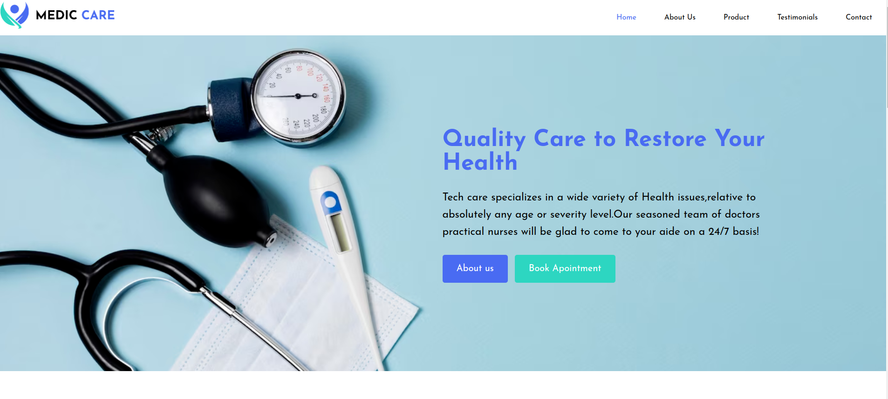
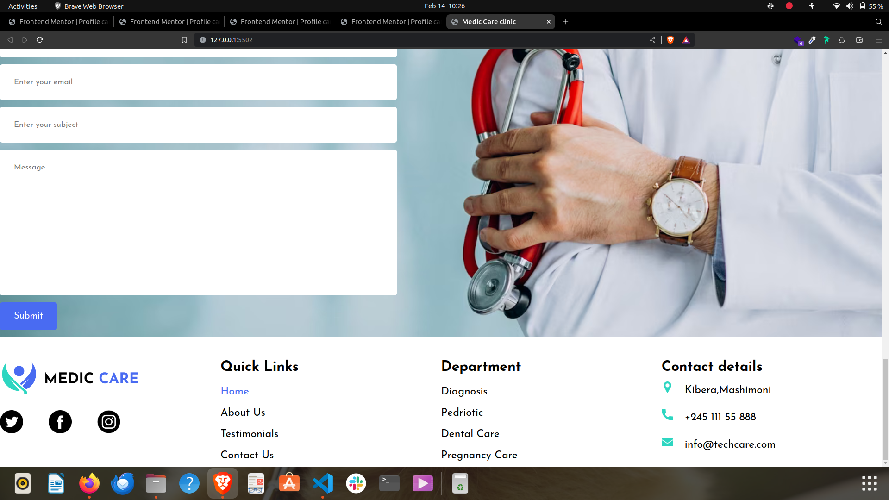

# Medic-Care Clinic.
___

## Projects description
___
Medic-care is a website for  a innovative medical campany where client can visit and learn more about there treatments and  services the campany offers.
## Live link
___
To access the project live use this link
[link]( https://daveomosh.github.io/Medicare-clinic/)
___
## screanshoot
___
This is how the project look like:
* Header Part

___
* About us part

___
* footer part
!

___
## technology used
___
* html
* css
___
## Projects set up and installation
___
1. open the terminal and navigate to where you want to store the project eg ``cd desktop``
2. To clone the git hub project paste this in the terminal ``git clone https://github.com/Daveomosh/Medicare-clinic.git``
3. Use `cd medic-care-clinic` to enter in the project directory
4. opened the project with your fevorite browser.
   ___
 ## Contact
 ___
For more information,feedback,collaboration or questions you can reach out to me via email : ***omondidave97@gmail.com***
___

## Lincense
MIT License

Copyright (c) [2024] [***DAVID 0MONDI***]

Permission is hereby granted, free of charge, to any person obtaining a copy
of this software and associated documentation files (the "Software"), to deal
in the Software without restriction, including without limitation the rights
to use, copy, modify, merge, publish, distribute, sublicense, and/or sell
copies of the Software, and to permit persons to whom the Software is
furnished to do so, subject to the following conditions:

The above copyright notice and this permission notice shall be included in all
copies or substantial portions of the Software.

THE SOFTWARE IS PROVIDED "AS IS", WITHOUT WARRANTY OF ANY KIND, EXPRESS OR
IMPLIED, INCLUDING BUT NOT LIMITED TO THE WARRANTIES OF MERCHANTABILITY,
FITNESS FOR A PARTICULAR PURPOSE AND NONINFRINGEMENT. IN NO EVENT SHALL THE
AUTHORS OR COPYRIGHT HOLDERS BE LIABLE FOR ANY CLAIM, DAMAGES OR OTHER
LIABILITY, WHETHER IN AN ACTION OF CONTRACT, TORT OR OTHERWISE, ARISING FROM,
OUT OF OR IN CONNECTION WITH THE SOFTWARE OR THE USE OR OTHER DEALINGS IN THE
SOFTWARE.
